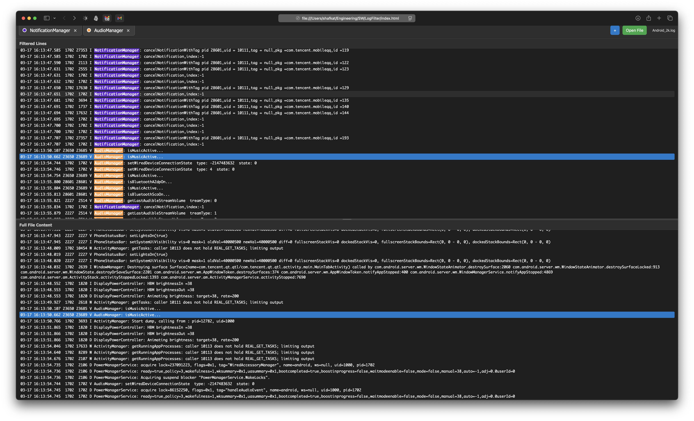

# Log Filter

A powerful, single-page web application for filtering and analyzing text files with real-time highlighting and search capabilities.

## Features

- **Drag & Drop File Loading**: Simply drag any text file onto the browser window to load it
- **Dynamic Filter Tabs**: Add multiple filter strings with custom colors
- **Real-time Filtering**: Instantly see lines that match your filter criteria
- **Dual View**: Compare filtered results with the full file content
- **Line Synchronization**: Click any filtered line to jump to its location in the full file
- **Clipboard Integration**: Automatically copy selected lines to clipboard
- **Persistent Filters**: Your filter tabs are saved between sessions
- **Responsive Design**: Adjustable split view with drag-to-resize functionality
- **Code-friendly**: Monospace font with syntax highlighting support

## How to Use

### Getting Started

1. **Open in Browser**
   - Double-click the `index.html` file to open it in your default browser
   - Or drag the file into any browser window

### Basic Usage

1. **Load a File**
   - Drag and drop any `.txt` or `.log` file onto the browser window
   - The file name will appear in the top bar

2. **Add Filter Tabs**
   - Click the `+` button in the top bar
   - Enter a search string
   - Choose a color for the filter
   - Click "Add" to create the filter tab

3. **Manage Filter Tabs**
   - Click on any filter tab to enable/disable it
   - Disabled tabs appear grayed out and won't filter content
   - Click the `×` button on any tab to remove it
   - Your filter tabs are automatically saved and restored when you reopen the page

4. **View Results**
   - The middle section shows only lines matching your enabled filters
   - Matched strings are highlighted with the tab colors
   - The bottom section shows the complete file content

5. **Navigate and Copy**
   - Click any line in the filtered section to jump to that line in the full file
   - The selected line is automatically copied to your clipboard
   - The full file view centers on the selected line for context

### Advanced Features

- **Adjustable Split View**: Drag the divider between the filtered and full content sections to resize them
- **Multiple Browser Tabs**: Open multiple instances of the app in different browser tabs to analyze different files simultaneously
- **Persistent Storage**: Your filter tabs are saved using browser local storage

## Setting Up as a Browser Bookmark

### Method 1: Direct File Bookmark

1. **Chrome/Edge:**
   - Open the `index.html` file in your browser
   - Press `Ctrl+D` (Windows) or `Cmd+D` (Mac) to bookmark
   - The bookmark will open the local file directly

2. **Firefox:**
   - Open the `index.html` file in Firefox
   - Press `Ctrl+D` (Windows) or `Cmd+D` (Mac) to bookmark
   - The bookmark will work the same way

3. **Safari:**
   - Open the `index.html` file in Safari
   - Press `Cmd+D` to bookmark
   - The bookmark will open the local file directly

### Method 2: Desktop Shortcut

1. **Mac:**
   - Right-click on `index.html`
   - Select "Make Alias"
   - Move the alias to your desktop or applications folder

## Use Cases

- **Log Analysis**: Filter through application logs to find specific error messages or events
- **Code Review**: Search through code files for specific functions or patterns
- **Data Processing**: Filter large text datasets for specific entries
- **Debugging**: Quickly find relevant lines in debug output
- **Document Analysis**: Search through documentation for specific topics

## Browser Compatibility

- Chrome 60+
- Firefox 55+
- Safari 12+
- Edge 79+

## Technical Details

- **Pure HTML/CSS/JavaScript**: No external dependencies
- **Local Storage**: Uses browser localStorage for persistent filter tabs
- **File API**: Uses HTML5 File API for drag-and-drop functionality
- **Clipboard API**: Modern clipboard integration for copying text
- **Responsive Design**: Works on all screen sizes
- **Cross-Browser Compatible**: Works in Chrome, Firefox, Safari, Edge

## Troubleshooting

### File Won't Load
- Make sure you're dragging a `.txt` or `.log` file
- Some browsers may have security restrictions on local files

### Filters Not Working
- Check that your filter string is spelled correctly
- The search is case-insensitive
- Try refreshing the page if filters seem stuck

### Copy to Clipboard Not Working
- Some browsers require HTTPS for clipboard access
- You can manually copy text by selecting it

### Performance Issues
- Very large files (>10MB) may be slow to process
- Consider splitting large files into smaller chunks
- Close other browser tabs to free up memory

## License

This project is open source and available under the MIT License. 